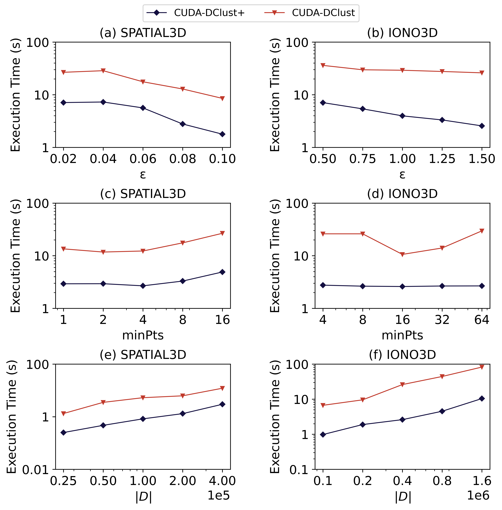

## 🌟 CUDA-DClust+: Fast DBSCAN algorithm implemented on CUDA

> CUDA-DClust+ is a fast DBSCAN algorithm that leverages many of the algorithm designs in CUDA-DClust and parallels DBSCAN algorithms in the literature.

> The algorithm takes as input the dataset D, ϵ, and <em>minpts</em>, and outputs a list of points and their corresponding cluster or whether it has been assigned a noise label. The algorithm constructs an index on the dataset $D$ based on the number of partitions $r$ at each level of the tree. Then, it performs the cluster expansion routine on the GPU and merges the clusters on the CPU.

> #### [Research Paper](./paper.pdf)

### Key contributions

- CUDA-DClust constructs the index using the CPU. In contrast, CUDA-DClust+ performs the construction of the index on the GPU in parallel. Since index construction takes non-negligible time, computing it in parallel on the GPU improves performance.
- CUDA-DClust uses a constant seed list size to keep track of points in the cluster expansion routine. The constant seed list size can inadvertently discard points from the cluster. To mitigate this issue, it refills the seed list to minimize discarding points. In contrast, CUDA-DClust+ uses a correction merge routine that merges the discarded points to their clusters. This improves performance and slightly improves the accuracy of the clustering results.
- CUDA-DClust uses a large seed list to maintain accurate clustering results. In contrast, a large seed list size is not necessary for CUDA-DClust+, as discarded points are merged by our correction merge routine.
- In CUDA-DClust+, the overhead of communication between CPU and GPU is minimized by managing the seed list within the DBSCAN expansion kernel until the seed lists are empty. Limiting CPU/GPU synchronization and other overheads improves performance.

### Outcome

[DBSCAN comparison paper](https://ieeexplore.ieee.org/document/9006169) by Mustafa et al. showed that GDBSCAN outperforms CUDA-DClust with speedup up to 18x. Using our optimizations, we show that CUDA-DClust+ achieves up to **~23x** speedup compared with GDBSCAN, demonstrating that the original CUDA-DClust design works well when optimized for newer GPU architectures.

### Future Works

Future work includes investigating the dense box algorithm that can be used to further reduce the number of distance calculations in high-density regions.

## Organization

    .
    ├── cpu-dbscan              # CPU DBSCAN algorithm
    ├── multicore-cpu           # Parallel Multi-threaded CPU DBSCAN algorithm
    ├── dbscan-cpu-indexing     # CUDA DBSCAN algorithm with CPU indexing
    ├── gdbscan                 # G-DBSCAN algorithm
    ├── cuda-dclust             # CUDA-DClust algorithm (clone)
    ├── comparision-plots       # Comparision plots with Jupyter Notebook code
    |── test-results            # Scripts to test the cluster results
    |── test-datasets           # 2D and 3D datasets for test
    |── main.cu                 # Main CUDA-DClust+ algorithm
    |── exp.cu                  # CUDA-DClust+ algorithm used in an experiment
    |── Makefile                # Makefile for CUDA-DClust+ algorithm
    └── paper.pdf               # Research paper

## Usage

### CUDA-DClust+

Change the DBSCAN configuration in 'common.h' file file and run

```bash
make && ./main.exe ./test-datasets/2d.txt
```

## Experimental Results

--

### 2D experiment


### 3D experiment


